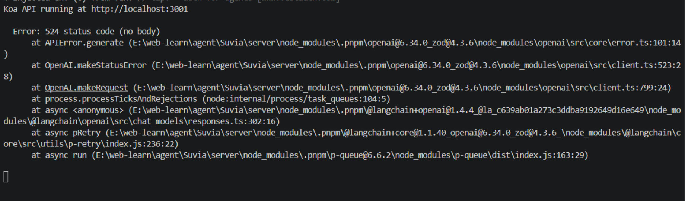
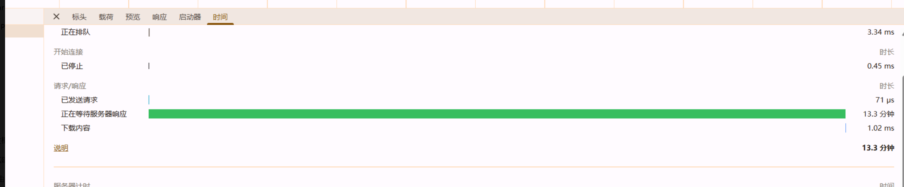

# 调用接口生成图片

lastMessage 中 有 lastMessage.kwargs.content 是一个数组，里面的结构为

```
{
  "type": "image",
  "mimeType": "image/png",
  "data": "iVBORw0KGgoAAAANSUhEUg..."
}
```

```
{
        "type": "text",
        "text": "我无法直接查看你所在位置的实时天气。\n\n你可以告诉我你的城市名，我可以帮你整理一份简短的天气查询建议；或者你也可以直接查看手机天气应用。",
        "annotations": [],
        "phase": "final_answer"
      }
```

如果是 图片帮我解析之后保存在本地，例外把处理 放回值交给一个工具类，不同类型采用不用的处理方法


# 长任务服务器超时






# 前端流式改造：抽离出请求，封装起来，把chat.tsx的中逻辑最简化，并使用自定义的 useChatStream 实现发送消息与相应

改造结构如下

```
src/
├─ components/
│  ├─ Chat.tsx
│  └─ Markdown.tsx
├─ hooks/
│  └─ useChatStream.ts
├─ services/
│  ├─ request.ts
│  └─ chatApi.ts
└─ utils/
   └─ sseStream.ts
```

## 1. components/Chat.tsx

## 职责

`Chat.tsx` 只负责页面展示和用户交互。

主要功能：

```txt
1. 管理输入框内容
2. 监听用户点击发送
3. 调用 sendMessage 发送消息
4. 展示用户消息
5. 展示 assistant 消息
6. 根据 isSending 控制按钮状态
```

不处理：

```txt
1. fetch 请求
2. ReadableStream 读取
3. SSE 解析
4. 流式文本拼接
5. 请求错误细节
```

## 使用内容

从 `useChatStream.ts` 获取：

```txt
1. messages：消息列表
2. isSending：是否正在发送
3. sendMessage：发送消息方法
```

从 `Markdown.tsx` 获取：

```txt
1. Markdown：用于渲染 assistant 返回的 Markdown 内容
```

## 导出内容

```txt
Chat
```

作用：

```txt
作为聊天页面主组件，供 App.tsx 或路由页面使用。
```

------

## 2. components/Markdown.tsx

## 职责

`Markdown.tsx` 只负责渲染 Markdown 内容。

主要功能：

```txt
1. 接收 assistant 返回的 Markdown 字符串
2. 渲染标题、段落、列表、代码块、表格等内容
3. 保证 AI 返回内容在页面中正常显示
```

不处理：

```txt
1. 消息发送
2. 流式请求
3. SSE 解析
4. 聊天状态管理
```

## 导出内容

```txt
Markdown
```

作用：

```txt
供 Chat.tsx 渲染 assistant 消息使用。
```

------

## 3. hooks/useChatStream.ts

## 职责

`useChatStream.ts` 是对话状态管理层。

主要功能：

```txt
1. 保存 messages 消息列表
2. 保存 isSending 发送状态
3. 创建用户消息
4. 创建 assistant 占位消息
5. 调用聊天接口 streamChat
6. 接收流式返回的文本片段
7. 将文本片段追加到 assistant 消息中
8. 接收并更新状态提示
9. 处理完成事件
10. 处理错误事件
```

不处理：

```txt
1. 页面布局
2. Markdown 渲染
3. fetch 具体实现
4. ReadableStream 具体读取过程
5. SSE event/data 具体解析过程
```

## 管理的数据

```txt
messages：
当前对话消息列表

isSending：
当前是否正在发送或接收回复
```

## 对外提供

```txt
messages：
给 Chat.tsx 渲染消息列表

isSending：
给 Chat.tsx 控制按钮禁用状态

sendMessage：
给 Chat.tsx 调用，用于发送用户输入
```

## 导出内容

```txt
ChatMessage
useChatStream
```

作用：

```txt
ChatMessage：
描述前端消息结构

useChatStream：
封装完整聊天状态逻辑
```

------

## 4. services/request.ts

## 职责

`request.ts` 是基础请求封装层。

主要功能：

```txt
1. 统一接口基础地址
2. 统一请求头
3. 统一请求体处理
4. 统一判断 HTTP 状态码
5. 返回原始 Response
```

注意：

```txt
流式接口需要读取 response.body，所以这里不应该直接转成 JSON。
```

不处理：

```txt
1. 具体聊天业务
2. SSE 流式解析
3. React 状态更新
4. Markdown 渲染
```

## 导出内容

```txt
RequestOptions
request
```

作用：

```txt
RequestOptions：
描述基础请求参数

request：
供 chatApi.ts 等接口层调用
```

------

## 5. services/chatApi.ts

## 职责

`chatApi.ts` 是聊天接口封装层。

主要功能：

```txt
1. 定义聊天请求消息结构
2. 封装 /api/chat 接口
3. 调用 request 发起请求
4. 检查响应体是否支持流式读取
5. 将 response.body 交给 sseStream 解析
```

不处理：

```txt
1. 页面状态
2. 消息列表更新
3. Markdown 渲染
4. SSE 具体解析细节
5. 底层 fetch 配置
```

## 导出内容

```txt
ChatRole
ChatRequestMessage
StreamChatOptions
streamChat
```

作用：

```txt
ChatRole：
定义消息角色类型

ChatRequestMessage：
定义发送给后端的消息结构

StreamChatOptions：
定义 streamChat 的调用参数

streamChat：
发起聊天流式请求
```

------

## 6. utils/sseStream.ts

## 职责

`sseStream.ts` 是 SSE 流式解析工具层。

主要功能：

```txt
1. 读取 ReadableStream
2. 将二进制数据解码成文本
3. 处理流式传输中的半包问题
4. 按 SSE 格式拆分消息块
5. 解析 event 字段
6. 解析 data 字段
7. 根据事件类型触发对应回调
```

它负责识别的事件类型：

```txt
text：
表示 assistant 新增文本片段

status：
表示当前生成状态提示

done：
表示流式响应结束

error：
表示后端返回错误
```

不处理：

```txt
1. 发起 HTTP 请求
2. React 状态更新
3. 页面显示
4. Markdown 渲染
```

## 后端响应格式要求

后端需要持续返回 SSE 格式数据：

```txt
event: status
data: {"message":"正在思考..."}

event: text
data: {"delta":"生成的文本片段"}

event: done
data: {}
```

每个事件之间需要用空行分隔。

## 导出内容

```txt
SseMessage
SseStreamHandlers
readSseStream
```

作用：

```txt
SseMessage：
描述解析后的 SSE 消息结构

SseStreamHandlers：
描述 text、status、done、error 等事件回调

readSseStream：
读取并解析后端返回的流式响应
```

------

## 7. 文件调用关系

```txt
Chat.tsx
  ↓
调用 useChatStream 提供的 sendMessage

useChatStream.ts
  ↓
调用 chatApi.ts 中的 streamChat

chatApi.ts
  ↓
调用 request.ts 中的 request

request.ts
  ↓
使用 fetch 请求后端 /api/chat

后端
  ↓
返回 SSE 流式响应

chatApi.ts
  ↓
把 response.body 交给 sseStream.ts

sseStream.ts
  ↓
解析 text / status / done / error

useChatStream.ts
  ↓
根据解析结果更新 messages

Chat.tsx
  ↓
根据 messages 重新渲染页面
```

## 8. 各文件导出总结

```txt
components/Chat.tsx
导出：Chat
作用：聊天页面主组件
components/Markdown.tsx
导出：Markdown
作用：Markdown 渲染组件
hooks/useChatStream.ts
导出：ChatMessage、useChatStream
作用：聊天状态管理
services/request.ts
导出：RequestOptions、request
作用：基础 fetch 请求封装
services/chatApi.ts
导出：ChatRole、ChatRequestMessage、StreamChatOptions、streamChat
作用：聊天接口封装
utils/sseStream.ts
导出：SseMessage、SseStreamHandlers、readSseStream
作用：SSE 流式响应解析
```


# 测试一: SRS 测试任务：校园设备报修管理系统

请根据以下项目需求，生成一份《软件需求规格说明书（SRS）》。

## 一、项目背景

某高校后勤部门负责校园内教学楼、实验楼、宿舍楼、办公楼等场所的设备维护工作。目前设备报修主要通过电话、微信群和纸质登记完成，存在报修信息不完整、工单流转不透明、维修进度难跟踪、统计数据不准确等问题。

学校计划建设一套“校园设备报修管理系统”，用于统一管理设备报修、工单派发、维修处理、进度跟踪、结果确认和统计分析等业务，提高后勤维修管理的规范性和可追溯性。

## 二、系统使用对象

系统主要用户包括：

```txt
1. 普通用户：学生、教师、行政人员，可提交设备报修申请并查看处理进度。
2. 后勤管理员：负责审核报修申请、派发维修工单、跟踪维修进度。
3. 维修人员：负责接收工单、反馈维修过程、提交维修结果。
4. 系统管理员：负责用户、角色、权限、基础数据和系统配置管理。
```

## 三、建设目标

```txt
1. 实现校园设备报修信息的统一提交和集中管理。
2. 实现报修申请、工单派发、维修处理、结果确认的全过程跟踪。
3. 支持不同角色按照权限访问对应功能和数据。
4. 支持维修数据查询、统计和导出。
5. 保留关键业务操作日志，便于责任追溯。
6. 支持后续与学校统一身份认证平台、短信平台或消息通知平台对接。
```

## 四、业务流程

系统基本业务流程如下：

```txt
1. 普通用户登录系统。
2. 用户填写报修信息，包括报修位置、设备类型、故障描述、现场照片、联系方式等。
3. 系统生成报修申请记录，状态为“待审核”。
4. 后勤管理员查看报修申请，判断信息是否完整、是否属于受理范围。
5. 对于有效报修，管理员创建维修工单并指派维修人员。
6. 维修人员接收工单，前往现场处理。
7. 维修人员填写维修过程、维修结果、使用材料、处理时间等信息。
8. 用户确认维修结果，可选择确认完成或申请返修。
9. 系统记录完整处理过程，并支持后续查询和统计。
```

## 五、核心功能需求

系统至少应包含以下功能模块：

```txt
1. 用户登录与退出
2. 用户管理
3. 角色与权限管理
4. 报修申请提交
5. 报修申请审核
6. 工单派发
7. 工单接收与处理
8. 维修结果确认
9. 返修申请
10. 报修记录查询
11. 工单状态跟踪
12. 维修统计分析
13. 数据导出
14. 消息通知
15. 操作日志审计
16. 系统基础配置
```

## 六、数据对象

系统主要数据对象包括：

```txt
1. 用户信息
2. 角色信息
3. 权限信息
4. 设备类型
5. 报修申请
6. 维修工单
7. 维修记录
8. 维修材料
9. 消息通知记录
10. 操作日志
```

## 七、外部接口需求

系统后续可能与以下外部系统对接：

```txt
1. 学校统一身份认证平台：用于用户单点登录和身份校验。
2. 短信平台：用于发送报修受理、工单派发、维修完成等提醒。
3. 校园消息平台：用于向用户推送系统消息。
4. 文件存储服务：用于保存报修照片、维修照片等附件。
```

## 八、非功能需求

```txt
1. 系统应支持基于角色的访问控制。
2. 普通查询操作在正常网络条件下响应时间不宜超过 3 秒。
3. 系统应保留登录、报修提交、审核、派单、维修处理、结果确认、返修等关键操作日志。
4. 用户上传的图片附件应限制格式和大小。
5. 系统应支持常见浏览器访问。
6. 系统应具备基础的数据备份和恢复能力。
7. 系统应对异常输入、重复提交、无权限访问等情况进行提示和拦截。
```

## 九、输出要求

请生成一份正式的《软件需求规格说明书（SRS）》，要求：

```txt
1. 使用多级编号标题。
2. 文档结构不少于以下章节：
   1. 引言
   2. 总体描述
   3. 业务需求分析
   4. 功能需求
   5. 数据需求
   6. 接口需求
   7. 非功能需求
   8. 运行与部署需求
   9. 验收需求
3. 功能需求必须按模块展开，不得只列功能名称。
4. 每个核心功能至少说明：功能目标、参与角色、输入信息、输出结果、异常处理。
5. 非功能需求必须尽量写成可验证条款。
6. 在合适位置添加图表占位符，例如系统功能结构图、业务流程图、功能需求清单表、非功能需求指标表。
7. 图表需要有编号和标题。
8. 避免使用“全面赋能、显著提升、智能化升级、强力保障、高效支撑”等宣传化表达。
9. 不要输出“以下是”“当然可以”“我将为你生成”等对话式内容。
10. 直接输出 SRS 正文。
```


# 自动优化

在现有 SRS 生成后端中新增质量评审与自动优化能力。系统在主代理生成 SRS 初稿后，调用评分子代理按照固定评分维度输出 100 分制评分结果。当评分低于配置文件中的 scoreThreshold 时，系统调用优化子代理根据评分意见对文档进行定向优化，并在优化后再次评分。优化过程受配置文件控制，包括是否启用评分、是否启用自动优化、评分阈值、最大优化轮次和最低有效提升分数。系统在达到评分阈值、达到最大优化轮次、分数无提升或提升不足时停止优化，并返回最终文档、最终评分、优化轮次和停止原因。评分结果与 SRS 正文应分离返回，便于前端单独展示质量评分面板


# 对话的持久化（短期以及、checkpointer）

已完成

# 新增聊天

最小化实现

# 消息摘要


# 工程结构优化

后面我想对后端代码的结构进行优化，把agent 和 tool 分开，更加工程化一点，各个agent 也分开，model.ts 更名为 openaimodel ,  patchStringifiedJsonResponses 方法抽离出去 放在 models 目录下，并且在models目录下 添加一个导出入口，能根据配置初始化不同的模型，后面可能会用到deepseek（兼容openai接口），如果还有其他可能优化结构的请提出来，


# bug

## 1. 重复输出文章

- 输出一边后主代理又生成一篇